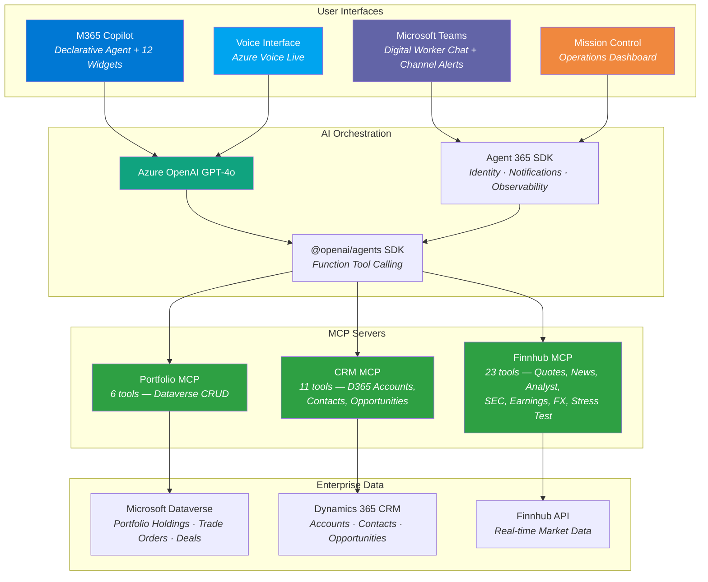
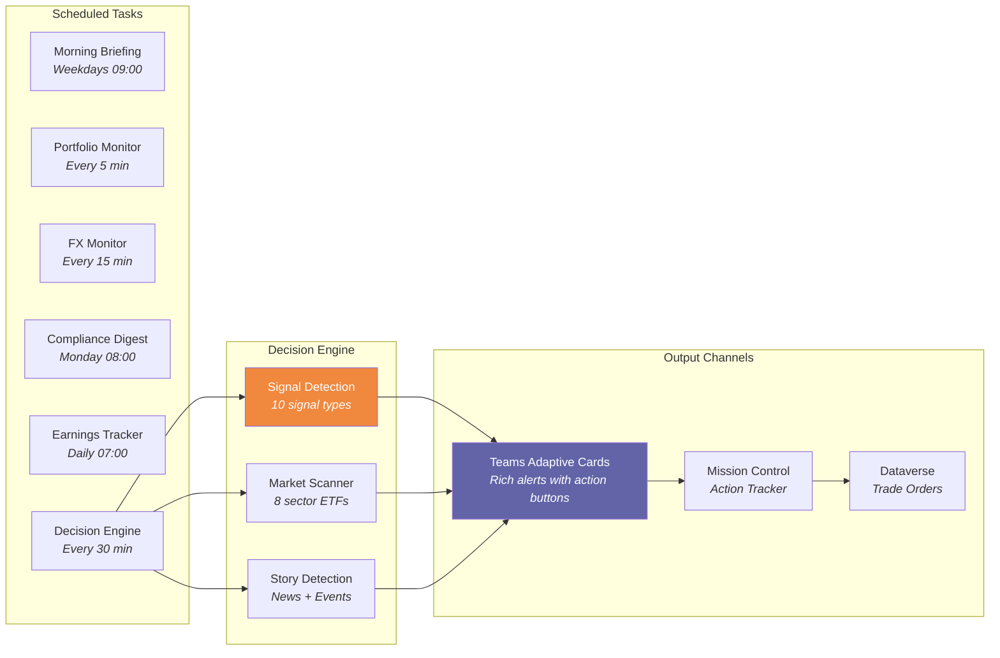
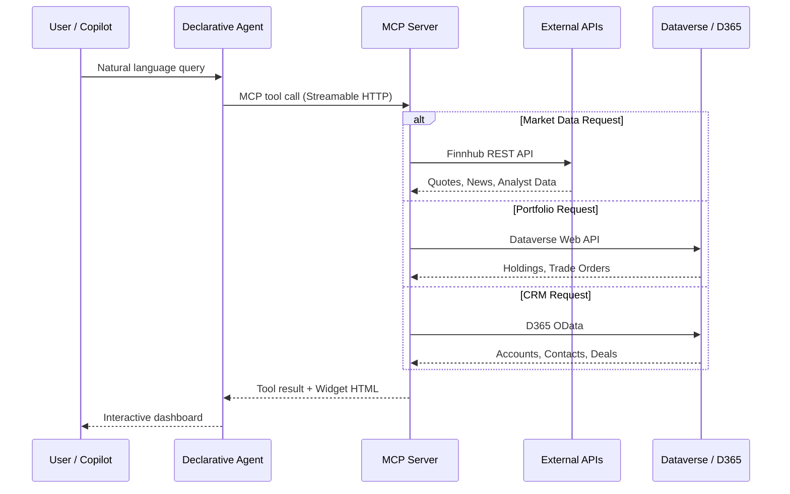
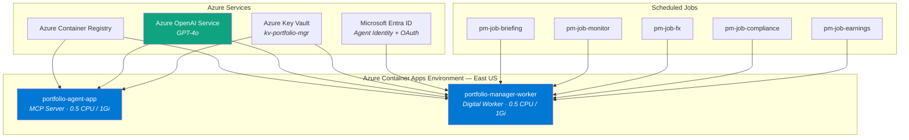

# Portfolio Manager — Alpha Intelligence Platform

> An AI-native investment portfolio management platform built entirely on the Microsoft AI stack.  
> Declarative Agent in M365 Copilot · Autonomous Digital Worker · Real-time Voice Interface · Mission Control Dashboard


---

## What It Does

A fully autonomous AI Portfolio Manager that reads live market data, manages CRM relationships, monitors risk in real-time, and takes action — all from natural language inside Microsoft 365 Copilot, with a Digital Worker that operates 24/7.

| Capability | Description |
|---|---|
| **40+ MCP Tools** | Across 3 custom servers (Finnhub, Portfolio, CRM) + 11 M365 platform MCP servers |
| **12 Interactive Widgets** | Rich HTML5 dashboards rendered in M365 Copilot chat |
| **Autonomous Digital Worker** | Own Entra identity, mailbox, Teams presence — runs 24/7 |
| **Mission Control** | Web-based operations dashboard with Neural Core visualization |
| **Decision Engine** | Multi-signal autonomous detection with adaptive card alerts |
| **Voice Interface** | HD voice with real-time tool calling via Azure Voice Live |

---

## Architecture

### High-Level Overview



### Digital Worker — Autonomous Operations



### Data Flow — MCP Protocol



---

## Infrastructure



---

## Widget Gallery

The Declarative Agent renders 12 interactive HTML5 dashboards directly inside M365 Copilot chat:

| # | Widget | Description |
|---|--------|-------------|
| 1 | **Portfolio Command Center** | Full portfolio treemap with live prices, sector allocation, clients/prospects tabs, compliance badges, FX exposure |
| 2 | **Morning Briefing** | Daily intelligence briefing — Portfolio Pulse KPIs, Market Movers, Client Alerts, Prospect Watch, AI Executive Commentary, RV Shifts, Market Opportunities |
| 3 | **Macro Stress Test** | Scenario analysis — S&P -20%, Rates +100bps, Oil +50% scenarios with waterfall charts and per-holding beta impact |
| 4 | **Concentration Risk** | HHI index, sector allocation, single-name limits, geographic and supply chain risk, diversification score |
| 5 | **Relative Value** | P/E vs Revenue Growth scatter plot, opportunity signals, peer comparison, dividend yield ranking |
| 6 | **RV Shift Detection** | Tracks valuation shifts over 7 days — what got expensive or cheap, analyst rating changes |
| 7 | **Challenge Holdings** | Flags expensive positions with weak analyst consensus — "Why are you still holding this?" |
| 8 | **Benchmark Comparison** | Sector weights vs benchmark, overweight/underweight analysis, active share, tracking error |
| 9 | **Client 360 View** | Unified market data + CRM profile — stock fundamentals, contacts, deal pipeline, activities |
| 10 | **CRM Pipeline** | Investment funnel — Qualify→Close stages, deal type badges (M&A/Capital Raise/Exit), weighted revenue |
| 11 | **Stock Quote** | Detailed quote card with price, change, 52-week range, analyst consensus, headlines |
| 12 | **CRUD Form** | Portfolio management — add/update holdings with pre-filled fields, submit to Dataverse |

---

## Decision Engine — Signal Types

The autonomous Decision Engine detects 10 signal types across portfolio holdings and the broader market:

| Signal | Source | Trigger |
|--------|--------|---------|
| `price_move` | Finnhub quotes | Price change exceeds threshold |
| `rv_shift` | Finnhub financials | P/E ratio shift vs sector peers |
| `analyst_change` | Finnhub consensus | Buy/Hold/Sell recommendation changes |
| `earnings_imminent` | Finnhub calendar | Earnings within 5 trading days |
| `fx_impact` | Finnhub FX rates | Currency exposure exceeds threshold |
| `news_event` | Finnhub news | Keyword-matched company news |
| `concentration_drift` | Portfolio data | Single-name or sector limit breach |
| `challenge` | Multi-source | Expensive + weak consensus |
| `market_opportunity` | 8 sector ETFs | Sector rotation detection |
| `story_change` | Company news | Earnings, management, corporate, regulatory events |

Alerts are delivered as **rich adaptive cards** in Teams with action buttons linking to Mission Control.

---

## Mission Control

A web-based operations dashboard served at `/mission-control` on the Digital Worker:

| Tab | Purpose |
|-----|---------|
| **Command Center** | System health, live activity feed, agent uptime, tool analytics |
| **Agent Mind** | Last agent reasoning trace, prompt inspection |
| **Neural Core** | Animated force-directed graph showing all 40+ tools and real-time data flow with pulse particles |
| **Actions** | Action tracker — pending decisions, deferred items, completed actions |
| **Today's Plan** | Current day schedule, upcoming tasks, briefing status |

---

## Project Structure

```
PortfolioManager/
├── appPackage/                    # M365 Declarative Agent
│   ├── declarativeAgent.json      # Agent v1.6 config (capabilities, plugins, starters)
│   ├── manifest.json              # Teams App Manifest v1.24
│   ├── instruction.txt            # Agent persona & instructions
│   ├── ai-plugin.json             # Finnhub MCP plugin (23 tools)
│   ├── portfolio-plugin.json      # Portfolio MCP plugin (6 tools)
│   └── crm-plugin.json            # CRM MCP plugin (11 tools)
│
├── mcp-server/                    # MCP Server (Express + MCP SDK)
│   ├── src/
│   │   └── mcp-server.ts          # All tool definitions, handlers, widget templates
│   ├── widgets/                   # HTML widget templates
│   ├── Dockerfile                 # node:20-slim container
│   └── package.json
│
├── digital-worker/                # Digital Worker (Agent 365 SDK)
│   ├── src/
│   │   ├── index.ts               # Express server, routes, Mission Control
│   │   ├── agent.ts               # PortfolioManagerAgent (A365 AgentApplication)
│   │   ├── client.ts              # OpenAI Agent + MCP client
│   │   ├── decision-engine.ts     # Autonomous multi-signal detection
│   │   ├── morning-briefing.ts    # Daily briefing generator
│   │   ├── briefing-prompt.ts     # Briefing prompt template
│   │   ├── portfolio-monitor.ts   # Price monitoring
│   │   ├── fx-monitor.ts          # FX rate monitoring
│   │   ├── compliance-digest.ts   # Weekly compliance digest
│   │   ├── earnings-tracker.ts    # Earnings calendar tracker
│   │   ├── trade-simulation.ts    # Trade simulation + order creation
│   │   ├── agent-tools.ts         # 40+ function tools
│   │   ├── teams-channel.ts       # Teams webhook + adaptive cards
│   │   ├── mission-control.html   # Operations dashboard (single-file)
│   │   └── voice-live.html        # Voice interface UI
│   ├── Dockerfile                 # node:20-slim container
│   └── package.json
│
├── .github/
│   └── workflows/                 # CI/CD pipeline (build, test, deploy)
│
├── e2e-tests/                     # End-to-end test suite
├── DEMO-SCRIPT.md                 # 12-minute demo walkthrough
└── agency.toml                    # Copilot agent configuration
```

---

## Technology Stack

| Layer | Technology |
|-------|-----------|
| **Agent Framework** | M365 Copilot Declarative Agent v1.6 |
| **Digital Worker** | Microsoft Agent 365 SDK (`@microsoft/agents-hosting` v1.2) |
| **LLM Orchestration** | `@openai/agents` v0.7 with function tool calling |
| **LLM** | Azure OpenAI Service — GPT-4o |
| **Tool Protocol** | Model Context Protocol (MCP) over Streamable HTTP |
| **Data** | Microsoft Dataverse + Dynamics 365 CRM |
| **Market Data** | Finnhub REST API |
| **Auth** | Microsoft Entra ID — Agentic OAuth2 + Client Credentials |
| **Hosting** | Azure Container Apps |
| **Registry** | Azure Container Registry |
| **CI/CD** | GitHub Actions (SecDevOps) |
| **Language** | TypeScript (100% backend) |
| **Runtime** | Node.js 20 |

---

## Installation & Setup

### Prerequisites

| Requirement | Version | Purpose |
|-------------|---------|---------|
| **Node.js** | 20.x+ | Runtime for MCP Server and Digital Worker |
| **npm** | 10.x+ | Package management |
| **.NET SDK** | 8.0+ | Agent 365 CLI (`a365`) |
| **Azure CLI** | 2.60+ | Azure resource management |
| **Docker** | 24.x+ | Local container builds (optional — ACR builds remotely) |
| **Git** | 2.40+ | Source control |

### Azure & M365 Requirements

- Azure subscription with **Contributor** role
- Azure Container Registry (Basic SKU or higher)
- Azure OpenAI Service with a **GPT-4o** deployment
- Azure Key Vault
- Microsoft 365 tenant with **Copilot licenses**
- Microsoft Entra ID — ability to create App Registrations
- Dynamics 365 CRM instance (or Dataverse environment)
- Finnhub API key (free tier: 60 calls/min) — [finnhub.io](https://finnhub.io)
- Agent 365 Frontier preview program access

---

### Step 1 — Clone & Install Dependencies

```bash
git clone https://github.com/robdye/PortfolioManager.git
cd PortfolioManager

# Install MCP Server dependencies
cd mcp-server && npm install && cd ..

# Install Digital Worker dependencies
cd digital-worker && npm install && cd ..

# Install E2E test dependencies (optional)
cd e2e-tests && npm install && cd ..
```

---

### Step 2 — Create Azure Resources

```bash
# Login to Azure
az login

# Create a resource group
az group create --name rg-portfolio-agent --location eastus

# Create Azure Container Registry
az acr create --resource-group rg-portfolio-agent --name <YOUR_ACR_NAME> --sku Basic --admin-enabled true

# Create Azure Key Vault
az keyvault create --resource-group rg-portfolio-agent --name <YOUR_KV_NAME> --location eastus

# Create Azure OpenAI Service (or use an existing one)
az cognitiveservices account create \
  --name <YOUR_AOAI_NAME> \
  --resource-group rg-portfolio-agent \
  --kind OpenAI \
  --sku S0 \
  --location eastus

# Deploy GPT-4o model
az cognitiveservices account deployment create \
  --name <YOUR_AOAI_NAME> \
  --resource-group rg-portfolio-agent \
  --deployment-name gpt-4o \
  --model-name gpt-4o \
  --model-version "2024-08-06" \
  --model-format OpenAI \
  --sku-capacity 30 \
  --sku-name Standard
```

---

### Step 3 — Register Entra ID Applications

You need **two** app registrations in Microsoft Entra ID:

#### 3a. MCP Server App Registration

1. Go to [Entra ID → App registrations](https://entra.microsoft.com/#view/Microsoft_AAD_RegisteredApps/ApplicationsListBlade)
2. **New registration** → Name: `Portfolio MCP Server`
3. Add API permissions:
   - `Dynamics CRM → user_impersonation` (Delegated)
   - `Microsoft Graph → Sites.Read.All` (Application)
4. Create a **client secret** → store in Key Vault
5. Note the **Application (client) ID** and **Directory (tenant) ID**

#### 3b. Digital Worker App Registration

1. **New registration** → Name: `Portfolio Digital Worker`
2. Add API permissions:
   - `Microsoft Graph → Mail.Send, Chat.ReadWrite, ChannelMessage.Send` (Application)
3. Create a **client secret** → store in Key Vault
4. Note the **Application (client) ID**

---

### Step 4 — Configure Environment Variables

```bash
# MCP Server
cp mcp-server/.env.template mcp-server/.env
```

Edit `mcp-server/.env` with your values:

```env
# Finnhub
FINNHUB_API_KEY=<your-finnhub-api-key>

# Dataverse / CRM
DATAVERSE_URL=https://<your-org>.crm.dynamics.com/api/data/v9.2
CRM_BASE_URL=https://<your-org>.crm.dynamics.com/api/data/v9.2

# Entra ID (MCP Server app)
SP_TENANT_ID=<your-tenant-id>
SP_CLIENT_ID=<your-mcp-app-client-id>
SP_CLIENT_SECRET=<your-mcp-app-client-secret>

# SharePoint (for document search)
SHAREPOINT_HOST=<your-tenant>.sharepoint.com
```

```bash
# Digital Worker
cp digital-worker/.env.template digital-worker/.env
```

Edit `digital-worker/.env` with your values:

```env
# Azure OpenAI
AZURE_OPENAI_ENDPOINT=https://<your-aoai>.openai.azure.com
AZURE_OPENAI_API_KEY=<your-aoai-key>
AZURE_OPENAI_DEPLOYMENT=gpt-4o

# MCP Server endpoints
MCP_FINNHUB_ENDPOINT=https://<your-mcp-app>.azurecontainerapps.io/finnhub/mcp
MCP_CRM_ENDPOINT=https://<your-mcp-app>.azurecontainerapps.io/crm/mcp
MCP_PORTFOLIO_ENDPOINT=https://<your-mcp-app>.azurecontainerapps.io/portfolio/mcp

# Manager identity (receives alerts)
MANAGER_EMAIL=<your-email>
MANAGER_NAME=<your-name>

# Scheduled job secret (any random string)
SCHEDULED_SECRET=<generate-a-random-secret>

# Teams Webhook (Power Automate Workflows webhook URL)
TEAMS_WEBHOOK_URL=<your-webhook-url>
```

---

### Step 5 — Local Development

```bash
# Terminal 1 — Start MCP Server
cd mcp-server
npm run dev
# Runs on http://localhost:3001

# Terminal 2 — Start Digital Worker
cd digital-worker
npm run dev
# Runs on http://localhost:3978
# Mission Control: http://localhost:3978/mission-control
```

Test health endpoints:
```bash
curl http://localhost:3001/health
curl http://localhost:3978/api/health
```

---

### Step 6 — Build & Deploy to Azure

#### Option A: Manual deployment

```bash
# Build and push container images to ACR
az acr build --registry <YOUR_ACR_NAME> --image portfolio-agent:v1 --file mcp-server/Dockerfile mcp-server/
az acr build --registry <YOUR_ACR_NAME> --image digital-worker:v1 --file digital-worker/Dockerfile digital-worker/

# Create Container Apps environment
az containerapp env create \
  --name portfolio-env \
  --resource-group rg-portfolio-agent \
  --location eastus

# Deploy MCP Server
az containerapp create \
  --name portfolio-agent-app \
  --resource-group rg-portfolio-agent \
  --environment portfolio-env \
  --image <YOUR_ACR_NAME>.azurecr.io/portfolio-agent:v1 \
  --registry-server <YOUR_ACR_NAME>.azurecr.io \
  --target-port 3001 \
  --ingress external \
  --min-replicas 1 --max-replicas 3 \
  --cpu 0.5 --memory 1Gi

# Deploy Digital Worker
az containerapp create \
  --name portfolio-manager-worker \
  --resource-group rg-portfolio-agent \
  --environment portfolio-env \
  --image <YOUR_ACR_NAME>.azurecr.io/digital-worker:v1 \
  --registry-server <YOUR_ACR_NAME>.azurecr.io \
  --target-port 3978 \
  --ingress external \
  --min-replicas 1 --max-replicas 3 \
  --cpu 0.5 --memory 1Gi
```

#### Option B: CI/CD via GitHub Actions

Configure these **GitHub repository secrets** first:

| Secret | Description |
|--------|-------------|
| `AZURE_CLIENT_ID` | Service principal client ID (OIDC) |
| `AZURE_TENANT_ID` | Entra tenant ID |
| `AZURE_SUBSCRIPTION_ID` | Azure subscription ID |
| `ACR_REGISTRY` | e.g., `myacr.azurecr.io` |
| `ACR_NAME` | e.g., `myacr` |
| `AZURE_RESOURCE_GROUP` | e.g., `rg-portfolio-agent` |
| `MCP_STAGING_URL` | Staging MCP health check URL |
| `WORKER_STAGING_URL` | Staging worker health check URL |
| `MCP_PRODUCTION_URL` | Production MCP health check URL |
| `WORKER_PRODUCTION_URL` | Production worker health check URL |

Then push to `main` — the pipeline runs automatically: Lint → Test → Build → Deploy.

---

### Step 7 — Provision the Declarative Agent

```bash
# Option 1: Teams Toolkit (VS Code extension)
# Open appPackage/ folder → Deploy → Provision

# Option 2: Manual upload
# 1. Zip the contents of appPackage/ (not the folder itself)
# 2. Go to Microsoft Teams Admin Center → Manage apps → Upload
# 3. Approve the app for your tenant
# 4. The agent appears in M365 Copilot as "Portfolio Manager"
```

---

### Step 8 — Set Up the Digital Worker Identity

The Digital Worker requires its own Entra identity (separate from user accounts) via the Agent 365 platform:

```powershell
# Install Agent 365 CLI
dotnet tool install --global Microsoft.Agents.A365.DevTools.Cli --prerelease

# Login and initialize
az login
cd digital-worker
a365 config init   # Interactive setup — enter your tenant, subscription, app IDs

# Register M365 platform MCP servers (Mail, Teams, Calendar)
a365 develop add-mcp-servers mcp_MailTools mcp_TeamsTools mcp_CalendarTools

# Provision the agent identity, assign licenses, and deploy
a365 setup all
a365 deploy
a365 publish

# Assign the agent license (update UPN in script first)
.\scripts\assign-agent-license.ps1
```

After publishing, the Digital Worker will appear as a user in your tenant with its own mailbox and Teams presence.

---

### Step 9 — Configure Scheduled Jobs

Deploy the Container Apps scheduled jobs for autonomous operations:

```bash
# Deploy scheduler jobs using the ARM template
az deployment group create \
  --resource-group rg-portfolio-agent \
  --template-file digital-worker/infra/scheduler-jobs.json \
  --parameters \
    workerUrl="https://<YOUR_WORKER_APP>.azurecontainerapps.io" \
    scheduledSecret="<YOUR_SCHEDULED_SECRET>"
```

This creates 11 cron jobs:

| Job | Schedule | Description |
|-----|----------|-------------|
| `pm-job-briefing` | Weekdays 09:00 | Morning intelligence briefing |
| `pm-job-monitor` | Every 5 min | Portfolio price monitoring |
| `pm-job-fx` | Every 15 min | FX rate monitoring |
| `pm-job-compliance` | Monday 08:00 | Weekly compliance digest |
| `pm-job-earnings` | Daily 07:00 | Earnings calendar tracker |
| `pm-job-decision-engine` | Every 30 min | Multi-signal detection |
| `pm-job-market-scan` | Every 30 min | 8-sector ETF market scanning |
| `pm-job-story-detection` | Every 30 min | Company news/event detection |
| `pm-job-rv-briefing` | Weekdays 16:00 | End-of-day RV shift briefing |
| `pm-job-today-plan` | Weekdays 08:30 | Daily plan generation |
| `pm-job-eod-summary` | Weekdays 17:00 | End-of-day summary |

---

## CI/CD Pipeline

The project uses GitHub Actions with SecDevOps best practices:

- **Code scanning** — CodeQL and dependency review on every PR
- **Secret detection** — GitHub Secret Scanning with push protection
- **Container builds** — ACR builds triggered on merge to `main`
- **Staged deployment** — Build → Test → Deploy to Azure Container Apps
- **Branch protection** — Required reviews, status checks, no force pushes

---

## Live Endpoints

| Service | URL |
|---------|-----|
| MCP Server | `https://<YOUR_MCP_APP>.azurecontainerapps.io` |
| Digital Worker | `https://<YOUR_WORKER_APP>.azurecontainerapps.io` |
| Mission Control | `https://<YOUR_WORKER_APP>.azurecontainerapps.io/mission-control` |
| Health Check | `https://<YOUR_WORKER_APP>.azurecontainerapps.io/api/health` |

---

## License

MIT
